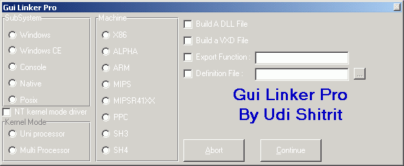



## Another Linker For VB 5 & 6 \!\!\!\!

### Description

<h4>The New version of the vb Gui Linker, Creates true Dynamic Link Lybraries in vb and its for free (now contain source code example)</h4>Download And Article :><a href="http://lockfree.50megs.com/linker.html">In here</a>
 
### More Info
 

             |
---                |---
**Submitted On**   |
**By**             |[Udi Shitrit](https://github.com/Planet-Source-Code/PSCIndex/blob/master/ByAuthor/udi-shitrit.md)
**Level**          |Intermediate
**User Rating**    |4.5 (45 globes from 10 users)
**Compatibility**  |VB 5\.0, VB 6\.0
**Category**       |[Complete Applications](https://github.com/Planet-Source-Code/PSCIndex/blob/master/ByCategory/complete-applications__1-27.md)
**World**          |[Visual Basic](https://github.com/Planet-Source-Code/PSCIndex/blob/master/ByWorld/visual-basic.md)
**Archive File**   |

### Source Code

<h3><a href="http://lockfree.50megs.com/linker.html">VB Gui linker For Version 5 & 6 - new version 06/03/2001</a> 
<h3><u>Important :</u></h2> 
<h3>The Current version doesnot include the original link.exe file  
in order to fit into all the versions and to avoid Runtime error - "Bad Record Number" 
to use the linker filter just rename your original link.exe to orglink.exe and save  the new link.exe in the vb98 /vb5 folder (instead of the original). 
all the actions have been taken by the linker in older versions are the same, 
except the dll creation process : 
to link a dynamic link library in vb you must compile your project as a PCode project 
the next step is the same : 
choose : make dll 
and specify the function name to export 
</h3> 
<h3>Tips: 
1.to return strings use the byref statement 
2.dont include forms in your project 
3.to export more than one function per dll use the definition file. 
(example for definition file: 
 
 EXPORTS 
 function1 
 function2 
 function3 
 
end of example) 
or you can write the first function in the export section and add the  following : /export:func2 /export:func3 
</h3> 
<h1>Enjoy It 
 
Udi S.
</h1>
</h1>

